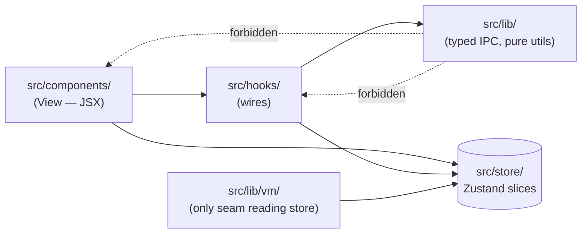
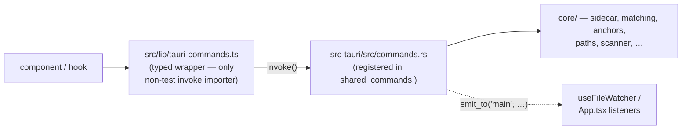
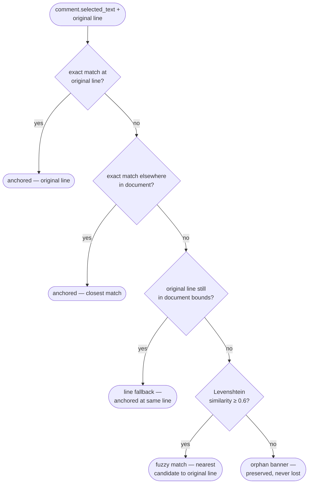

# Architecture

Canonical for structural and layering rules. Cite violations as "violates rule N in `docs/architecture.md`". Charter: [`docs/principles.md`](principles.md).

## Principles

Unique to architecture. Rust-First is a charter meta-principle — see [`docs/principles.md`](principles.md).

1. **Single IPC Chokepoint.** Every `invoke()` flows through `src/lib/tauri-commands.ts`, which owns wrapper signatures, argument shape, and TypeScript return types mirrored from Rust.
2. **Single Logging Chokepoint.** Frontend logging flows through `src/logger.ts`; Rust logging uses `tracing`/`log::*`, both routed by `tauri-plugin-log` to one rotating file.
3. **State Stratification.** Domain state (comments) lives in MRSF sidecar files; reactive UI state in Zustand; ephemeral view state (scroll, selection, folding) in component `useState`/`useRef`. Persist middleware serializes UI only.
4. **Commands Mutate, Events Notify.** Tauri commands do imperative work and return typed results. Events notify async change. Events can fire before React's first `useEffect`, so deterministic bootstrap uses commands.
5. **Layer Directionality.** Dependencies flow inward only: `components/` → `hooks/` → `lib/` → `store/`. `lib/vm/` is the single seam where `lib/` may read `@/store`. `lib/` never imports `components/` or `hooks/`.



## Rules

### IPC & logging chokepoints



1. Every Tauri IPC call goes through a typed wrapper in `src/lib/tauri-commands.ts`; production code never imports `invoke` directly. (`src/lib/tauri-commands.ts:1` is the only non-test `invoke` importer.)
2. Every new Rust command ships with a matching typed TS wrapper; the wrapper's return type matches the Rust `Result<T, String>` unwrapped `T`. (`commands/comments/mod.rs` ↔ `tauri-commands.ts:50`.)
3. Every Rust command is registered in `shared_commands!` in `src-tauri/src/lib.rs:222-262`. Commands are grouped under `src-tauri/src/commands/<feature>.rs` (`src-tauri/src/commands/mod.rs:7-15`): `fs` (incl. `update_tree_watched_dirs` for folder-tree watches), `comments`, `search`, `html`, `launch`, `remote_asset` (bounded HTTPS image proxy — `fetch_remote_asset`; bounds in rule 27 of [`docs/security.md`](security.md)), plus the iter-2 onboarding/platform-integration set (`onboarding` ×3, `cli_shim` ×3, `default_handler` ×2, `folder_context` ×3 — see [`docs/features/installation.md`](features/installation.md)). Path resolution shared by both the GUI and CLI binaries lives in `src-tauri/src/core/paths.rs`.

   *Structured-return chokepoint.* When a single command's caller needs the bytes AND cheap-to-compute metadata (size, line count, …), return a struct that carries both rather than forcing a second IPC round-trip. Canonical example: `read_text_file` returns `TextFileResult { content, size_bytes, line_count }` (`commands/fs.rs:71-109`) so the StatusBar reads from a Zustand-cached `fileMetaByPath` populated by `useFileContent` — neither component issues its own metadata IPC. See rule 2 in [`docs/performance.md`](performance.md).
4. All frontend logging goes through `src/logger.ts`; no file outside `src/logger.ts` and its test imports from `@tauri-apps/plugin-log`.
5. Log prefix tags: frontend `[web]`, Rust `[rust]` or a subsystem like `[watcher]`. (`src/logger.ts:9-13`; `watcher.rs:93`.)
6. `console.log`/`console.info` never appear in production frontend code. Diagnostic logging in watcher hooks goes through `@/logger` (`warn`/`debug`), not `console.*`. (`useFileWatcher.ts:45,57,61`.)

### MRSF ownership (Rust is the source of truth)
7. MRSF sidecar read/write/serde/reparenting lives in Rust (`src-tauri/src/core/sidecar.rs`, `core/comments.rs`); TypeScript never parses or serializes sidecars.
8. Sidecar-mutating commands emit `comments-changed` after save. (`commands/comments/mod.rs` `with_sidecar_mut`; atomic write via `core/atomic.rs::write_atomic`.)
9. The 4-step re-anchoring algorithm is a single Rust pipeline exposed via `get_file_comments`. (`commands/comments/mod.rs`.)
10. SHA-256 of `selected_text` is computed in Rust via `compute_anchor_hash`. (`commands/comments/mod.rs`.)

### Commands vs events
11. Launch args flow through a pending-args queue in Rust (`src-tauri/src/commands/launch.rs::PendingArgsState`). First-instance bootstrap, second-instance forwarding, and macOS `RunEvent::Opened` all push onto the queue. Frontend drains via `get_launch_args` IPC; the `args-received` event is signal-only (no payload). The IPC return type stays `LaunchArgs` (single struct with merged `files`/`folders` fields) — the queue is purely Rust-internal. (`useLaunchArgsBootstrap.ts:14,21`; `lib.rs:101`; `commands/launch.rs:15`.)
12. The file watcher lives in Rust and emits `file-changed` with kinds `content | review | deleted`. (`watcher.rs:58,88-92`.) Debounce: rule 4 in [`docs/performance.md`](performance.md). Also emits `folder-changed` events with payload `{ path: string }` (canonical directory) when a watched directory's children change. Frontend registers watched directories via `update_tree_watched_dirs(root, dirs)`, capped at `MAX_TREE_WATCHED_DIRS = 1024`. See `src-tauri/src/watcher.rs`.
13. The frontend never polls the filesystem; reactive reload uses watcher events routed through `useFileWatcher` → DOM `CustomEvent("mdownreview:file-changed")`. (`useFileWatcher.ts:51-73`.)
14. Ghost-entry scanning uses a single Rust command. (`commands/launch.rs:26` `scan_review_files`.) Cap: rule 3 in [`docs/performance.md`](performance.md).

### State boundaries
15. Zustand `persist` serializes only UI state: `theme`, `folderPaneWidth`, `commentsPaneVisible`, `root`, `expandedFolders`, `authorName`, `readingWidth`, `recentItems`, `tabs`, `activeTabPath`, `updateChannel`, `zoomByFiletype`. `ghostEntries`, `lastSaveByPath`, `lastFileReloadedAt`, `lastCommentsReloadedAt`, `viewModeByTab`, `fileMetaByPath`, `updateStatus`, comments, scroll values, tab back/forward history (`tabHistory` slice — session-only), and `viewerPrefsSlice.allowedRemoteImageDocs` are never persisted — trust decisions like remote-image allowance must not silently survive an app restart. (`store/index.ts` `partialize`; tabs slice `store/tabs.ts:39-58`; viewerPrefs slice `store/viewerPrefs.ts`; tabHistory slice `store/tabHistory.ts`.)
16. Cross-slice state changes from a single user action group into one store action. (`store/index.ts:149-161` `closeTab`.)
17. `lib/` never imports `components/` or `hooks/`; `lib/vm/` is the only place `lib/` reads `@/store`. (Grep-verified: `@/components` / `@/hooks` in `src/lib/` → 0; `@/store` → only `src/lib/vm/use-comment-actions.ts:2`.)

### Component & viewer boundaries
18. Viewer components route through `ViewerRouter` based on `FileStatus` from `useFileContent`. (`ViewerRouter.tsx:93-132`.)
19. Components subscribe to the store with narrow selectors (single-field or `useShallow`), never unfiltered `useStore()`. (`App.tsx:49-63`; `TabBar.tsx:8-10`.)
20. Comment mutation UI uses `useCommentActions` (`src/lib/vm/use-comment-actions.ts`); components never call low-level `addComment`/`editComment` wrappers. (`CommentThread.tsx:30,113`.)
21. Comment rendering reads through `useComments` (`src/lib/vm/use-comments.ts`); components never call `getFileComments` directly.
22. `read_dir` filters out sidecar files (`.review.yaml`, `.review.json`) before returning. (`commands/fs.rs:49-51`.)

### File-size budgets
23. Any file >400 lines in `src/components/` or `src-tauri/src/` is a structural smell and must be split. Shared-chokepoint files (`src/store/index.ts`, `src/App.tsx`, `src-tauri/src/lib.rs`) get a 500-line budget. The old `src-tauri/src/commands.rs` god-file was deleted in iter 2 and is now the `commands/` folder; iter-1 of #71 further split `commands/comments.rs` and `core/types.rs` to keep every file under the 400-line threshold (current snapshot: `core/html_assets.rs` 353, `core/comments.rs` 332, `core/types.rs` 328, `core/sidecar.rs` 321, `core/fold_regions.rs` 303, `lib.rs` 288, `core/matching.rs` 284, `MarkdownViewer.tsx` 454, `commands/comments/mod.rs` ~270, `store/tabs.ts` ~230, `store/index.ts` 438). `MarkdownViewer.tsx` is now over budget after the iter-2 footnote/math/zoom additions and is queued for extraction (the in-doc link handler and rehype-pipeline memo are the natural split points).

### Native menu
24. Native OS menu events are forwarded as `menu-*` Tauri events handled in `src/hooks/useMenuListeners.ts`, not invoked as commands. (`lib.rs:193-212`; `useMenuListeners.ts:22-54`.)

### Sidecar writes
25. TypeScript code MUST NOT write `*.review.{yaml,json}` sidecar files directly. All sidecar mutations flow through Rust commands (`add_comment`, `add_reply`, `edit_comment`, `delete_comment`, `update_comment`) so the canonical `with_sidecar_or_create` / `mutate_sidecar_or_create` chokepoint owns atomic write, anchor preservation, and watcher notification. Enforced by meta-test `src/__tests__/no-ts-sidecar-writes.test.ts`.

### Platform-divergent commands
26. When an IPC command's behavior diverges by OS, the parent file at `src-tauri/src/commands/<feature>.rs` declares the public command + return type, then dispatches to a platform sub-module via `#[cfg(target_os = "X")] mod x; #[cfg(target_os = "X")] use x as imp;` and calls `imp::function(&app)`. The per-OS implementations live in `src-tauri/src/commands/<feature>/{macos,windows,unsupported}.rs`. Every feature MUST also ship an `unsupported.rs` so the build never fails on a new target — the canonical pattern is to return the `Unsupported` variant of the feature's status enum. Per-OS submodules are required when behavior diverges substantially; inline `cfg!(target_os = "x")` / `#[cfg(target_os = "x")]` branches are acceptable for argv-only differences (e.g. `commands/system.rs`, where `build_reveal_command` flips the binary + a single `/select,` vs `-R` arg, and `open_in_default_app` routes Windows through `tauri-plugin-opener` while keeping macOS/Linux on a shared `Command` builder). (`commands/cli_shim.rs:14-27`; `commands/default_handler.rs:16-29`; `commands/folder_context.rs:15-23`; inline form: `commands/system.rs`.)

### Atomic writes
27. Any Rust code that persists user data to disk MUST go through `core/atomic.rs::write_atomic` (temp-file + rename). A crash mid-write must never leave a half-written destination. Currently used by sidecar persistence and `core/onboarding.rs::save_at`.

## MRSF v1.0 sidecar schema

Comments persist as **Markdown Review Sidecar Format (MRSF) v1.0** — an open standard ([specification](https://sidemark.org/specification.html)) compatible with VS Code's Sidemark extension. One sidecar per reviewed document:

- `<filename>.review.yaml` (primary)
- `<filename>.review.json` (legacy read-only fallback)

```yaml
mrsf_version: "1.0"
document: "filename.ext"
comments:
  - id: "uuid"                          # required
    author: "Display Name (id)"         # required, "Name (identifier)"
    timestamp: "2025-04-15T10:00:00Z"   # required, RFC 3339
    text: "Comment text"                # required
    resolved: false                     # required
    # Anchor (optional)
    line: 42                            # 1-based
    end_line: 45
    start_column: 10                    # 0-based
    end_column: 30
    selected_text: "code here"
    selected_text_hash: "sha256..."
    # Metadata (optional)
    type: "suggestion"                  # suggestion | issue | question | accuracy | style | clarity
    severity: "low"                     # low | medium | high
    reply_to: "parent-uuid"
    commit: "abc1234"
```

### Threading
Flat `reply_to` model — replies are top-level comments with `reply_to` referencing the parent's `id`. No nested `responses[]`.

### 4-step re-anchoring
Canonical implementation: `src-tauri/src/core/matching.rs:12`.

1. **Exact match** — find `selected_text` at the original line, then search the full document.
2. **Line fallback** — if the original line number is still in bounds, anchor there.
3. **Fuzzy match** — Levenshtein similarity ≥ 0.6, prefer closest to original line.
4. **Orphan** — all strategies failed; comment displays with an orphan banner.



### Surviving AI refactoring
Layered defenses: (1) 4-step re-anchoring; (2) sidecars travel alongside source files; (3) ghost entries surface deleted-source sidecars; (4) the Rust watcher auto-reloads content and comments. Debounce/save-loop windows: rules 4-6 in [`docs/performance.md`](performance.md).

## Gaps

- No ESLint rule blocks direct `invoke()` imports outside `src/lib/tauri-commands.ts`.
- No ESLint rule blocks direct `@tauri-apps/plugin-log` imports outside `src/logger.ts`.
- No lint rule blocks `console.log/info` in production code.
- Dependency directionality (rule 17) not mechanically enforced; `dependency-cruiser` would codify it.
- TS types in `tauri-commands.ts` are hand-mirrors of `src-tauri/src/core/types.rs`; a codegen step (`ts-rs`, `specta`) would remove drift risk.
- File-size budgets (rule 23) not enforced by CI.
<!-- Reviewed 2026-04-24: all gaps still valid. Iter 2 added platform sub-module rule (26) + atomic-write rule (27); `commands.rs` god-file deleted in favor of `commands/` folder. -->