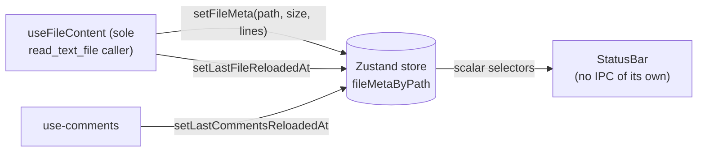

# App Chrome

## What it is

The persistent UI surfaces that frame every workspace view: the **top toolbar** (file/folder/comments controls + native menu actions), the **viewer toolbar** (sticky source/visual/wrap toggle inside each viewer), and the **status bar** at the bottom of the window. Together they give the app its IDE-like feel without intruding on the content area.

## How it works

### Top toolbar

A flex row pinned above the main area. The left side holds a button group (Open File / Open Folder / Comments toggle / Settings — 4 buttons total) that does NOT shrink — those controls stay readable at every viewport width. The right side hosts the `TabBar`, whose wrapper *does* shrink (`flex-shrink: 1; min-width: 0`) so when many tabs are open the inner scroll strip overflows naturally and the left/right chevrons appear without any DOM-level workaround.

The Settings button (gear icon) flips `settingsOpen` on the store. The no-tab area then routes to `<WelcomeView>` by default and to `<SettingsView>` when `settingsOpen=true` — see [settings.md](settings.md).

After the post-redesign cleanup, the toolbar carries no theme dropdown or About button — those moved into the native OS menu. App-level menu events (Theme · Light/Dark/System, About, Check for Update) are forwarded as `menu-*` Tauri events handled in `useMenuListeners` (rule 24 in [`docs/architecture.md`](../architecture.md)).

### Viewer toolbar (sticky)

Each viewer renders a `ViewerToolbar` overlay at the top of its scroll container. It is `position: sticky; top: 0; z-index: 2`, so it stays in view as the body scrolls. It carries the active-view toggle (Source ↔ Visual) for files that support both, plus a Wrap toggle for source views, a **Comment on file** button (opens an inline file-level composer in the comments panel), and a **Next unresolved (workspace-wide)** button that jumps to the next file in the workspace with unresolved threads — the same action chord-bound to `N`.

### Status bar

A single-row strip at the bottom of the window reports state for the active tab:

- **Path** — truncated from the head with an ellipsis so the filename always remains readable.
- **Size** — formatted via `formatSize` (`B` / `KB` / `MB`) from the `fileMetaByPath` cache.
- **Lines** — formatted with thousands separators from the same cache.
- **File reloaded N min ago** — relative time since the last successful `read_text_file` for this path.
- **Comments reloaded N min ago** — relative time since the last successful `get_file_comments`.

Critically, the status bar does NOT call `useFileContent` — that hook is the **sole issuer** of `read_text_file` IPC. The cached `{ sizeBytes, lineCount }` values arrive via `setFileMeta` which `useFileContent` calls on success (see the structured-IPC chokepoint note in [`docs/architecture.md`](../architecture.md) §IPC chokepoints, rule 19 in [`docs/performance.md`](../performance.md)).

A single `setInterval(60_000ms)` rerenders the relative-time labels every minute. The interval is registered in an effect keyed on `activeTabPath` and cleared on unmount or tab switch — there is at most one timer active per window. All four data sources (`fileMetaByPath`, `lastFileReloadedAt`, `lastCommentsReloadedAt`, `activeTabPath`) are read with **fine-grained scalar selectors** so an unrelated path's update does not re-render the status bar.

## Key source

- **Top toolbar:** `src/App.tsx` (`.toolbar` block) · `src/styles/app.css` (`.toolbar*` rules)
- **Tab bar:** `src/components/TabBar/TabBar.tsx` · `src/styles/tab-bar.css` (`.tab-bar-wrapper` flex-shrink:1, min-width:0)
- **Viewer toolbar (sticky):** `src/components/viewers/ViewerToolbar.tsx` · `src/styles/viewer-toolbar.css` (`position: sticky; top: 0; z-index: 2`)
- **Status bar:** `src/components/StatusBar/StatusBar.tsx` · `src/styles/status-bar.css`
- **Store fields:** `src/store/tabs.ts` — `fileMetaByPath`, `lastFileReloadedAt`, `lastCommentsReloadedAt`, `activeTabPath` (all session-only, never persisted — rule 15 in [`docs/architecture.md`](../architecture.md))
- **Hook contract:** `src/hooks/useFileContent.ts` (calls `setFileMeta` on success); `src/lib/vm/use-comments.ts` (calls `setLastCommentsReloadedAt`)

## Related rules

- IPC chokepoint + structured returns — rules 1-3 in [`docs/architecture.md`](../architecture.md).
- Persist allowlist (status-bar caches are session-only) — rule 15 in [`docs/architecture.md`](../architecture.md).
- One IPC round-trip per user action — rule 2 in [`docs/performance.md`](../performance.md).
- Status-bar 60-second tick + scalar selectors — rule 20 in [`docs/performance.md`](../performance.md), rule 19 in [`docs/architecture.md`](../architecture.md).
- Native menu events forwarded as Tauri events — rule 24 in [`docs/architecture.md`](../architecture.md).
- File-size budgets for the chrome files — rule 23 in [`docs/architecture.md`](../architecture.md).
