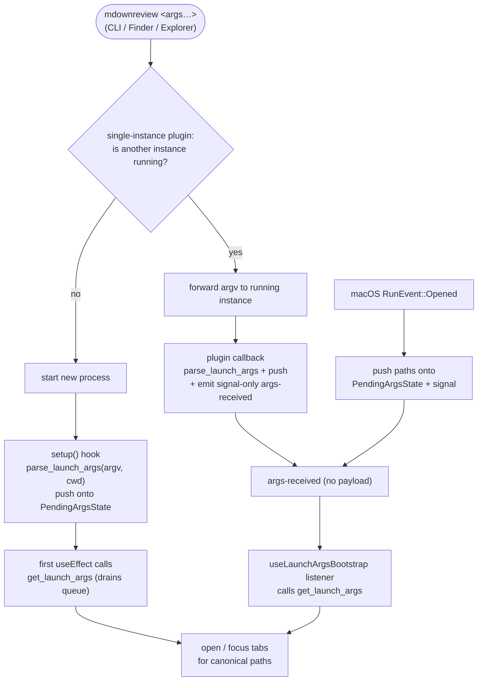

# CLI & File Associations

## What it is

mdownreview ships two binaries:

- **`mdownreview`** — the GUI app. Accepts file/folder arguments on launch (CLI, Finder, Explorer double-click, drag-and-drop) and is registerable as the default handler for `.md` / `.mdx` files on Windows and macOS.
- **`mdownreview-cli`** — a standalone command-line tool for working with MRSF sidecars without the GUI (CI pipelines, agent automation).

Opening the GUI a second time with a new file reuses the running instance (single-instance plugin) and switches to or creates the tab for the requested path.

## How it works

### GUI launch path

Single-instance behaviour is provided by `tauri-plugin-single-instance`. Secondary-launch arguments are forwarded to the running instance via the plugin callback; the running instance treats the forwarded argv like a normal file-open request.

Launch arguments flow through a **pending-args queue** (`PendingArgsState` in `commands/launch.rs`). Three producers push onto the queue: the initial `setup()` hook (first instance, parses `std::env::args()`), the single-instance plugin callback (second-instance argv forwarding), and macOS `RunEvent::Opened` (Finder open events). The frontend drains the queue once on mount via `get_launch_args`; the `args-received` Tauri event is **signal-only** (no payload) and tells already-mounted code to call `get_launch_args` again to drain anything new. The queue prevents fast successive opens from clobbering each other if the frontend has not yet polled.

`parse_launch_args` accepts argv in either order: `--folder <root>` may appear before or after positional file paths. Two passes:

1. Collect every `--folder` value and canonicalize against `cwd`.
2. Resolve `--file <path>` and bare positionals against the **first** collected folder if any, else `cwd`. Absolute paths bypass the base entirely. Positional dirs become folders, positional files become files.

Multi-file launches from the OS shell are forwarded as a single argv batch:

- **Windows:** the NSIS installer (`installer/installer-hooks.nsh`) registers the file-association open verb as `"…\mdownreview.exe" %*` (not `%1`). Selecting 2+ `.md` files in Explorer and pressing Enter passes every selected path on one command line; the running instance opens all of them in tabs.
- **macOS:** Finder dispatches each open as a `RunEvent::Opened` event; each event's paths are pushed onto the pending-args queue, so the frontend's next drain merges them.

File-association registration is per-user (no UAC elevation on Windows, no sudo on macOS) and is driven by install-time scripts configured in `tauri.conf.json`.

Path handling crosses an OS boundary and is therefore canonicalized on entry (see [`docs/security.md`](../security.md)). CLI launch is symmetric with double-click: same argv shape, same tab-reuse logic.



### `mdownreview-cli` subcommand reference

All subcommands operate on MRSF sidecars (`<source>.review.yaml` preferred, `<source>.review.json` legacy fallback). Source-vs-sidecar **auto-detection**: if the input path ends in `.review.yaml`/`.review.json` it is used verbatim; otherwise the CLI probes `<input>.review.yaml` then `<input>.review.json`. Path resolution: absolute paths bypass `--folder`; relative paths are joined to `--folder` if supplied, else to the current working directory. Top-level `mdownreview-cli --help` prints aggregated help (top-level + every subcommand's long help) so a single invocation surfaces every flag.

#### `read` — show review comments

| Flag | Description |
|---|---|
| `--folder <path>` | Root directory for sidecar discovery and relative-path resolution (default: cwd). |
| `--file <path>` | Single source-or-sidecar file mode. Surfaces errors (missing, outside-root) instead of silently skipping. |
| `--format <text\|json>` | Output format. Default `text`. |
| `--json` | Shorthand for `--format json` (overrides `--format`). |
| `--include-resolved` | Include resolved comments in output. Default: unresolved only. |

#### `respond` — add a response and/or mark a comment resolved

| Flag / arg | Description |
|---|---|
| `--folder <path>` | Restricts file resolution to a root (default: cwd). |
| `<file>` (positional) | Source file or sidecar (relative to `--folder` or cwd, or absolute). |
| `<comment_id>` (positional) | Comment ID to respond to. |
| `--response <text>` | Optional response message text. |
| `--resolve` | Mark the comment as resolved. May be combined with `--response`. |

At least one of `--response` / `--resolve` should be supplied to do useful work. (The legacy standalone `resolve` subcommand was folded into `respond --resolve`.)

#### `cleanup` — delete fully-resolved sidecars

| Flag | Description |
|---|---|
| `--folder <path>` | Root directory to scan (default: cwd). |
| `--dry-run` | Preview deletions without removing files. |
| `--include-unresolved` | Also delete sidecars containing unresolved comments. |

### Output shapes

**JSON envelope (single-file mode):**

```json
{
  "reviewFile": { "relative": "rel/foo.md.review.yaml", "absolute": "/abs/.../foo.md.review.yaml" },
  "sourceFile": { "relative": "rel/foo.md", "absolute": "/abs/.../foo.md" },
  "comments": [ /* raw YAML→JSON comment objects, unknown fields preserved */ ]
}
```

**JSON envelope (folder scan):** an array of the single-file envelopes, one per sidecar with at least one matching comment.

**Text output** (one block per source file):

```
-- <source-relative-path> (N {unresolved|all} comments) --
[id] line N [type] (severity) author · timestamp
> comment text
quoted: "selected_text"            # if anchor has selected_text
  > response text                  # zero or more responses, indented
[RESOLVED] [id] line N …           # [RESOLVED] prefix when --include-resolved and resolved=true
```

## Key source

- **Entry points:** `src-tauri/src/main.rs`, `src-tauri/src/lib.rs` (plugin registration, setup hook, panic hook)
- **GUI launch:**
  - `src-tauri/src/commands/launch.rs::PendingArgsState` (FIFO queue type)
  - `src-tauri/src/commands/launch.rs::parse_launch_args` (argv → `LaunchArgs`)
  - `src-tauri/src/commands/launch.rs::get_launch_args` (IPC drain)
- **Path resolution:** `src-tauri/src/core/paths.rs` (shared by GUI and CLI: `resolve_path`, `resolve_sidecar`, `source_for_sidecar`, `sidecar_for_source`, `classify_path`)
- **CLI binary:** `src-tauri/src/bin/cli.rs` (clap subcommands: `read`, `respond`, `cleanup`)
- **Installer hooks:** `src-tauri/installer/installer-hooks.nsh` (NSIS HKCU file association uses `%*` for multi-select forwarding)
- **Config:** `src-tauri/tauri.conf.json` (capabilities, single-instance, file-association metadata)

## Related rules

- Path canonicalization on every externally-sourced path — [`docs/security.md`](../security.md).
- Capability ACL minimization — [`docs/security.md`](../security.md).
- Single-instance behaviour and the "reuse or create tab" rule — [`docs/design-patterns.md`](../design-patterns.md).
- Per-user association registration (no elevation) — [`docs/principles.md`](../principles.md) Non-Goals (no UAC/sudo).
- Rule 13 in [`docs/test-strategy.md`](../test-strategy.md) — the CLI/association scenarios are native-e2e territory; each native spec must include the rule-13 block comment explaining why it cannot be a browser test.
