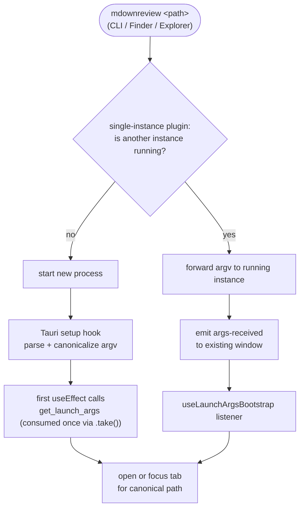

# CLI & File Associations

## What it is

mdownreview opens from the command line (`mdownreview <path>`) and is registerable as the default handler for `.md` / `.mdx` files on Windows and macOS. Opening the same instance a second time with a new file reuses the running app (single-instance) and switches to or creates the tab for the requested path.

## How it works

Single-instance behaviour is provided by `tauri-plugin-single-instance`. Secondary-launch arguments are forwarded to the running instance via the plugin callback; the running instance treats the forwarded argv like a normal file-open request.

Launch-time arguments are read inside the app through `get_launch_args` — the same mechanism the first instance uses to open whatever the user double-clicked in Finder or Explorer. File-association registration is per-user (no UAC elevation on Windows, no sudo on macOS) and is driven by install-time scripts configured in `tauri.conf.json`.

Path handling crosses an OS boundary and is therefore canonicalized on entry (rule in [`docs/security.md`](../security.md)). CLI mode is symmetric with double-click: the same command, the same argv shape, the same tab-reuse logic.

## Key source

- **Entry points:** `src-tauri/src/main.rs`, `src-tauri/src/lib.rs` (plugin registration, setup hook, panic hook)
- **Command:** `src-tauri/src/commands/launch.rs` — `get_launch_args`
- **Bin:** `src-tauri/src/bin/` for any helper binaries
- **Config:** `src-tauri/tauri.conf.json` (capabilities, single-instance, file-association metadata)

## Related rules

- Path canonicalization on every externally-sourced path — [`docs/security.md`](../security.md).
- Capability ACL minimization — [`docs/security.md`](../security.md).
- Single-instance behaviour and the "reuse or create tab" rule — [`docs/design-patterns.md`](../design-patterns.md).
- Per-user association registration (no elevation) — [`docs/principles.md`](../principles.md) Non-Goals (no UAC/sudo).
- Rule 13 in [`docs/test-strategy.md`](../test-strategy.md) — the CLI/association scenarios are native-e2e territory; each native spec must include the rule-13 block comment explaining why it cannot be a browser test.
