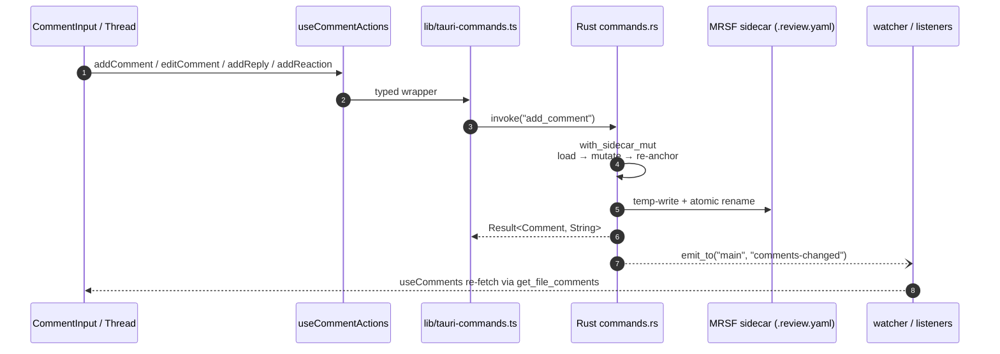

# Review Comments

## What it is

The core workflow of the app: a user reviewing AI-generated files selects a span of text, leaves an inline comment, replies, resolves, and moves on. Comments are threaded, line-anchored, indestructible across refactors, and persisted to disk next to the reviewed file — never to a database or a cloud service.

## How it works

Persistence lives in per-file MRSF sidecars (`foo.md` → `foo.md.review.yaml`). The MRSF v1.0 schema, atomic write protocol, and sidecar lifecycle are defined in [`docs/architecture.md`](../architecture.md) and [`docs/security.md`](../security.md). Rust is the source of truth: React asks for comments via a typed command, renders them, and sends mutations back — the frontend never writes YAML.

Anchoring survives file edits through a 4-step algorithm — exact match at original line, full-document exact search, line fallback, fuzzy Levenshtein, then orphan. The algorithm is implemented in Rust core and specified in [`docs/architecture.md`](../architecture.md) §4-step re-anchoring. Orphaned comments never disappear silently — they surface in the `DeletedFileViewer` when their file is removed, and in an orphan banner when their anchor text no longer matches.

### Anchor variants (v1.1)

Beyond the v1.0 `Line` anchor, MRSF v1.1 adds six non-line variants for content where line numbers don't apply: `Image_rect` (percentage-coordinate region on a bitmap), `Csv_cell` (row + col + header + optional primary key), `Json_path` (JSONPath + optional scalar value), `Html_range` (CSS selector + offset range + selected text), `Html_element` (CSS selector + tag + preview), and `Word_range`. `Word_range` pins comments to a UAX#29-tokenized span (start..end word indices on the line) plus a normalized text snippet — see `core/word_tokens.rs` and `core/types/mod.rs::WordRangePayload`. A further variant, `File`, anchors a comment to the whole file. Each typed variant has a heuristic resolver in `src-tauri/src/core/anchors/<matcher>.rs` (`image_rect.rs`, `csv_cell.rs`, `json_path.rs`, `html.rs`, `word_range.rs`) dispatched through `resolve_anchor` in `core/anchors/mod.rs`. The wire layout is FLAT (`anchor_kind` discriminator + per-variant payload sibling) so the v1.0 round-trip stays byte-identical for pure line anchors; the in-memory canonical form is the tagged `Anchor` enum (`src/types/comments.ts`, `src-tauri/src/core/types/mod.rs`). When a file is refactored and a v1.1 anchor cannot resolve, the matcher falls back to `anchor_history` (FIFO cap of 3 prior positions); if every history entry also fails, the comment becomes file-level rather than orphaned. Anchor moves from the UI route through `update_comment` with `CommentPatch::MoveAnchor`, which auto-pushes the prior anchor through the FIFO `push_anchor_history` chokepoint (cap 3) before installing the new one.

The UI surface is a selection toolbar that appears on text selection, a comment input, a threaded reply view, and an aggregated panel that summarises unresolved counts across the workspace, an **Export** button that copies a workspace-wide review-summary markdown digest to the clipboard, and quick-reaction glyphs (👍/✓/✗) on each thread. Line-gutter indicators in `SourceView` make every anchored comment discoverable at a glance.

To re-anchor an existing comment, click **Move** on a Line/File-anchored thread: the body switches to crosshair cursor and a sticky banner ("Click a line to move the comment.") appears at the top of the app; clicking any source line in `MarkdownViewer` or `SourceView` re-anchors via `update_comment` (`CommentPatch::MoveAnchor`), and pressing Esc or the banner's Cancel button exits move mode without changes. Missed clicks (anywhere outside a renderable source line) leave move mode active so a stray click never silently cancels. The button is hidden on typed-anchor threads (CSV cell, JSON path, HTML, image rect, word range) where re-anchoring to a Line would lose payload information — edit/delete those instead.

### Author identity

New comments are stamped with a display name configured in the **Settings** dialog (gear button in the top toolbar). The value is persisted to `OnboardingState.author` in the app config directory via the `set_author` Tauri command, with strict validation (≤128 bytes, no control characters, no newlines) returning a typed `ConfigError` discriminator on rejection.

On every launch the renderer hydrates the cached display name via `get_author`, which falls back to the OS user — `USERNAME` (Windows) or `USER` (macOS / Linux), and finally `"anonymous"` — when nothing has been saved. This is read synchronously from the Zustand `authorName` cache by every `add_comment` call site (`useCommentActions`), so creating a comment never blocks on an IPC round-trip.

There is no authentication and no cloud component: the display name is purely a local label written into the MRSF sidecar alongside each comment. To use the env-var path, no extra crate is pulled in (Lean pillar — see [`docs/principles.md`](../principles.md)).

## Key source

- **UI components:** `src/components/comments/{CommentInput,CommentThread,CommentsPanel,CommentBadge,LineCommentMargin,SelectionToolbar}.tsx`; `src/components/SettingsDialog.tsx` (display-name field). `CommentsPanel` carries the file-level `+` button (Group B / iter 5) which mounts an inline `CommentInput` whose Save submits a `{ kind: "file" }` anchor through `add_comment`; the focused row (DOM focus from J/K and click) gets a `:focus-within` halo via CSS + `aria-current="true"` so the user can see which thread R will resolve. An Export button calls `exportReviewSummary` IPC and writes the rendered markdown to the clipboard with a transient `comments-panel-status` aria-live region. `ReactionRow` (in `CommentThread.tsx`) renders the `👍/✓/✗` glyphs that dispatch `update_comment` with an `add_reaction` patch via the VM `addReaction` action — see [`docs/architecture.md`](../architecture.md) §v1.1 reactions schema.
- **Markdown wiring:** comments inside `.md` documents are rendered through the Markdown viewer split (`MarkdownViewer.tsx` shell + `MarkdownComponentsMap.tsx` rehype/remark wiring + `MarkdownInteractionLayer.tsx` event bridge + `CommentableBlocks.tsx` per-block popover) — see [`docs/features/viewer.md`](./viewer.md). The popover anchors to the deepest matching node when both an outer block and an inner cell share the same source line: cells carry `data-source-cell-line=N` and the popover effect prefers it over `data-source-line` (C7 / iter 5 fix).
- **TypeScript types:** `src/types/comments.ts` — Anchor discriminated union, `MrsfComment`, `deriveAnchor` adapter (mirrors Rust `core/types/wire.rs`)
- **Hooks:** `src/hooks/{useSelectionToolbar,useThreadsByLine,useFileBadges}.ts`; `src/lib/vm/useAuthor.ts` (display-name VM, hydrates `authorName` on launch)
- **Store slice:** `src/store/comments.ts` — `commentsSlice` (focus + navigation + cross-file scroll-to-line dispatch with `setTimeout(50)` deferral so the new viewer's listener has mounted before the event fires; the slice deliberately exposes only `focusedThreadId` — there is no global "open input" tracking, every composer self-closes on Escape).
- **Drafts:** `src/lib/comment-drafts.ts` (`readDraft`/`writeDraft`/`clearDraft`) — localStorage-backed per-anchor slot used by every composer (`CommentInput`, `CommentThread` reply box, `CommentsPanel` file-level `+`). Keys are derived from `${filePath}::reply::${commentId}` or `${filePath}::new::${fingerprintAnchor(anchor)}` so drafts never collide across anchors. The slot is hydrated on mount, persisted on every keystroke, and cleared **only after** the IPC `add_comment`/`add_reply` resolves successfully — a transient failure leaves the user's text intact in both the textarea and localStorage so they can retry without retyping. Cancel and the toolbar dismiss path also clear the slot. Backed by an in-memory map fallback for SSR / quota-exceeded / privacy-mode browsers.
- **Keyboard:** `src/hooks/useGlobalShortcuts.ts` owns the document-level chord set: `Ctrl+Shift+M` starts a comment on the current text selection, `J`/`K` move focus through unresolved threads in the active file, `N` jumps to the next unresolved thread across files (the same action is surfaced as the **Next-unresolved** button in `ViewerToolbar`; cross-file scroll-to-line is deferred via `setTimeout(50)` so the new viewer's listener is mounted), `R` resolves the focused thread, `Alt+Left`/`Alt+Right` navigate tab history. Escape is **not** wired globally — each composer's `<textarea>` handles its own Escape (closes the input + clears the draft slot) so editor-local cancellation never races a global handler. The skip-when-editable guard in the hook protects every other chord from firing while the user types in any input.
- **Rust core:** `src-tauri/src/core/{anchors,matching,sidecar/,types/,word_tokens,comments,threads,severity,export,mrsf_version}.rs`
- **Commands:** `src-tauri/src/commands/comments/{mod.rs,get.rs,badges.rs,export.rs,update.rs}` — `mod.rs` hosts the mutating commands (`add_comment`, `add_reply`, `edit_comment`, `delete_comment`, `compute_anchor_hash`) plus the `NewCommentAnchor` IPC discriminator (an untagged enum that accepts both the canonical `{ kind: "..." }` tagged shape and the legacy flat `{ line, ... }` payload, then maps to the canonical `Anchor` enum); `get.rs` hosts `get_file_comments` and the resolution perf-guard tests; `badges.rs`/`update.rs`/`export.rs` round out the read/update/export surface. Also: `src-tauri/src/commands/config.rs` — `set_author`, `get_author`; `src-tauri/src/commands/launch.rs` — `scan_review_files`.
- **Anchor resolver:** `src-tauri/src/core/anchors/mod.rs` — `resolve_anchor(&Anchor, &LazyParsedDoc) -> MatchOutcome` is the per-typed-anchor dispatcher invoked by `get_file_comments`, with heuristic resolvers per matcher: `image_rect.rs` (no-op coordinate validation), `csv_cell.rs` (header + primary-key lookup), `json_path.rs` (JSONPath traversal with optional scalar check), `html.rs` (HtmlRange + HtmlElement selector match), `word_range.rs` (UAX#29 word-index span verification). `LazyParsedDoc` (`OnceCell`) caches one parse per file per call regardless of comment count. `FileBadge.orphan_count` is not yet populated by the badge path — current badges count typed anchors as `Exact`; lazy orphan classification in the badge path is deferred to a future iter.

## Related rules

- MRSF v1.0 + v1.1 schema + 4-step re-anchoring — [`docs/architecture.md`](../architecture.md).
- Atomic sidecar writes and save-loop prevention — [`docs/security.md`](../security.md) + [`docs/design-patterns.md`](../design-patterns.md).
- Anchor branches each need an integration test — rule 3 + rule 8 in [`docs/test-strategy.md`](../test-strategy.md).
- Comment-matching branch coverage — rule 3 in [`docs/test-strategy.md`](../test-strategy.md); round-trip MRSF test — rule 8.
- "Reliable" pillar (comments indestructible across refactors) and "Zero Bug Policy" — [`docs/principles.md`](../principles.md).
