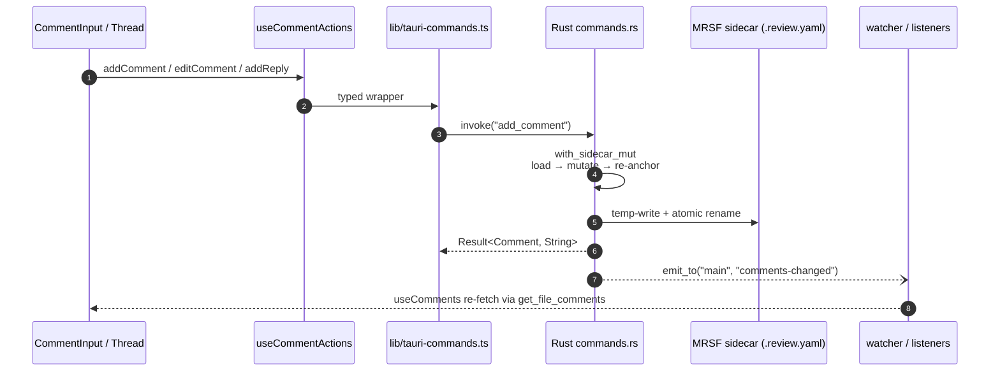

# Review Comments

## What it is

The core workflow of the app: a user reviewing AI-generated files selects a span of text, leaves an inline comment, replies, resolves, and moves on. Comments are threaded, line-anchored, indestructible across refactors, and persisted to disk next to the reviewed file — never to a database or a cloud service.

## How it works

Persistence lives in per-file MRSF sidecars (`foo.md` → `foo.md.review.yaml`). The MRSF v1.0 schema, atomic write protocol, and sidecar lifecycle are defined in [`docs/architecture.md`](../architecture.md) and [`docs/security.md`](../security.md). Rust is the source of truth: React asks for comments via a typed command, renders them, and sends mutations back — the frontend never writes YAML.

Anchoring survives file edits through a 4-step algorithm — exact match at original line, full-document exact search, line fallback, fuzzy Levenshtein, then orphan. The algorithm is implemented in Rust core and specified in [`docs/architecture.md`](../architecture.md) §4-step re-anchoring. Orphaned comments never disappear silently — they surface in the `DeletedFileViewer` when their file is removed, and in an orphan banner when their anchor text no longer matches.

The UI surface is a selection toolbar that appears on text selection, a comment input, a threaded reply view, and an aggregated panel that summarises unresolved counts across the workspace. Line-gutter indicators in `SourceView` make every anchored comment discoverable at a glance.

### Author identity

New comments are stamped with a display name configured in the **Settings** dialog (gear button in the top toolbar). The value is persisted to `OnboardingState.author` in the app config directory via the `set_author` Tauri command, with strict validation (≤128 bytes, no control characters, no newlines) returning a typed `ConfigError` discriminator on rejection.

On every launch the renderer hydrates the cached display name via `get_author`, which falls back to the OS user — `USERNAME` (Windows) or `USER` (macOS / Linux), and finally `"anonymous"` — when nothing has been saved. This is read synchronously from the Zustand `authorName` cache by every `add_comment` call site (`useCommentActions`), so creating a comment never blocks on an IPC round-trip.

There is no authentication and no cloud component: the display name is purely a local label written into the MRSF sidecar alongside each comment. To use the env-var path, no extra crate is pulled in (Lean pillar — see [`docs/principles.md`](../principles.md)).

## Key source

- **UI components:** `src/components/comments/{CommentInput,CommentThread,CommentsPanel,LineCommentMargin,SelectionToolbar}.tsx`; `src/components/SettingsDialog.tsx` (display-name field)
- **Hooks:** `src/hooks/{useSelectionToolbar,useThreadsByLine,useUnresolvedCounts}.ts`; `src/lib/vm/useAuthor.ts` (display-name VM, hydrates `authorName` on launch)
- **Store slice:** `src/store/index.ts` — `commentsSlice`
- **Rust core:** `src-tauri/src/core/{comments.rs,threads.rs,anchors.rs,matching.rs,sidecar.rs,types.rs,severity.rs,export.rs,mrsf_version.rs}`
- **Commands:** `src-tauri/src/commands/comments/{mod.rs,badges.rs,export.rs,update.rs}` — `get_file_comments`, `add_comment`, `add_reply`, `edit_comment`, `delete_comment`, `compute_anchor_hash`, `get_unresolved_counts`, `update_comment`, `get_file_badges`, `export_review_summary`; `src-tauri/src/commands/config.rs` — `set_author`, `get_author`; `src-tauri/src/commands/launch.rs` — `scan_review_files`

## Related rules

- MRSF v1.0 schema + 4-step re-anchoring — [`docs/architecture.md`](../architecture.md).
- Atomic sidecar writes and save-loop prevention — [`docs/security.md`](../security.md) + [`docs/design-patterns.md`](../design-patterns.md).
- Anchor branches each need an integration test — rule 3 + rule 8 in [`docs/test-strategy.md`](../test-strategy.md).
- Comment-matching branch coverage — rule 3 in [`docs/test-strategy.md`](../test-strategy.md); round-trip MRSF test — rule 8.
- "Reliable" pillar (comments indestructible across refactors) and "Zero Bug Policy" — [`docs/principles.md`](../principles.md).
