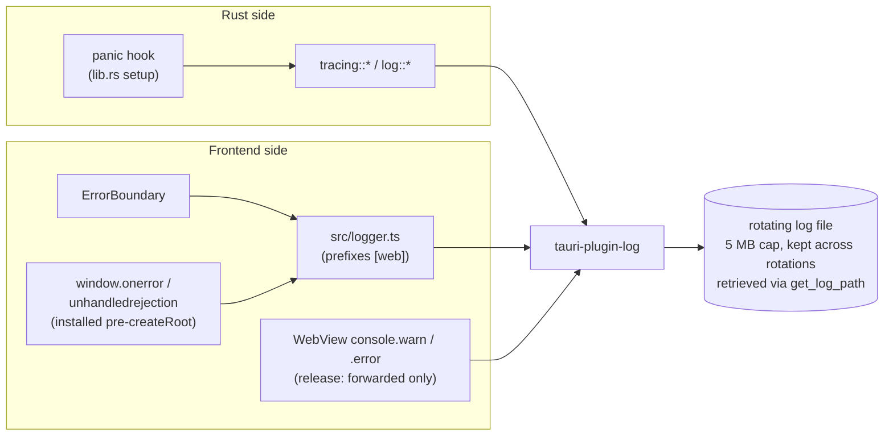

# Logging

## What it is

A single rotating log file captures output from both the Rust backend and the React frontend, with frontend messages tagged `[web]` and Rust messages flowing through `tracing`. Unhandled exceptions on either side are caught and routed into the same file — production users can attach one file when reporting issues.

## How it works

Rust logging uses `tracing` + `tracing-subscriber` + `tauri-plugin-log` to route every `log::*` and `tracing::*` call to the rotating file. The same plugin exposes a frontend logger; `src/logger.ts` is the single frontend chokepoint (rule 2 in [`docs/architecture.md`](../architecture.md)) and prefixes every message with `[web]` before invoking the plugin.

A panic hook installed in `lib.rs` converts Rust panics into logged error events before the process unwinds. On the React side, an `ErrorBoundary` component catches render-time errors and forwards them through `logger`; unhandled rejections on `window` are also captured. Tests install a `console.error` / `console.warn` spy at setup so a silent test failure that merely logs an error surfaces as a hard failure (principle 2 in [`docs/test-strategy.md`](../test-strategy.md)).

The log file lives in the OS-appropriate per-user location; users retrieve it via `get_log_path`. There is no in-app log viewer and no network log upload — both are Non-Goals in [`docs/principles.md`](../principles.md).

## Key source

- **Rust:** `src-tauri/src/lib.rs` (plugin registration, panic hook), any `tracing::*` calls throughout `src-tauri/src/`
- **Frontend chokepoint:** `src/logger.ts`
- **Error capture:** `src/components/ErrorBoundary.tsx`
- **Command:** `src-tauri/src/commands/launch.rs` — `get_log_path`
- **Test contract:** `src/test-setup.ts` (console spy)

## Related rules

- Single logging chokepoint — rule 2 in [`docs/architecture.md`](../architecture.md). Tests MUST NOT import `@tauri-apps/plugin-log` directly — rule 23 in [`docs/test-strategy.md`](../test-strategy.md).
- `[web]` prefix on every frontend message — [`docs/design-patterns.md`](../design-patterns.md).
- Exception capture contract (Rust panic hook + React ErrorBoundary + `window.onerror` + `unhandledrejection`) — [`docs/security.md`](../security.md).
- Console silence as a first-class assertion — principle 2 in [`docs/test-strategy.md`](../test-strategy.md).
- No in-app log viewer; no log upload — [`docs/principles.md`](../principles.md) Non-Goals.
