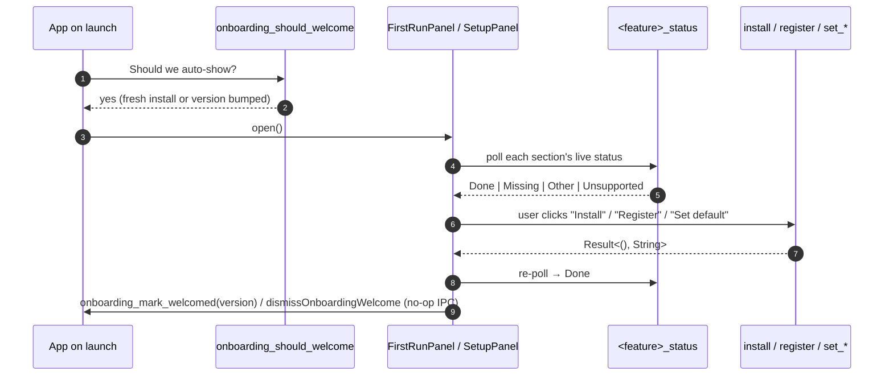

# Onboarding

## What it is

The first-run welcome flow and the always-available **Setup** panel that walks a new user through everything mdownreview wants the OS to know about it: where the CLI lives, which agent skills are recommended, whether `.md` opens with mdownreview by default, and whether the folder context-menu is registered.

The same UI doubles as a "what's new" surface — re-shown automatically after an update so existing users see what changed without having to read release notes.

It is deliberately **skippable**, **non-blocking**, and **idempotent**: every section reflects live OS state, not a stored "I clicked this once" bit.

## How it works

A small Rust ViewModel (`core/onboarding.rs`, persisted at `app_config_dir/onboarding.json`) owns the "have we welcomed this user / which sections have they seen" state. The frontend reads it once on mount via `useOnboardingBootstrap`, and each setup section reads its **live** OS status through a dedicated IPC command — never from the persisted state. This means a user who installs the CLI from the terminal and re-opens the app sees that section as `Done` without ever clicking the in-app button.

## Components

- **`FirstRunPanel`** — auto-shown on first launch and after a version bump. Wraps `SetupPanel` with welcome copy and a "Skip for now" affordance.
- **`SetupPanel`** — always available from the Help menu. Renders a list of `SectionShell` cards.
- **`SectionShell`** — generic per-section frame: title, status pip (`Done` / `Missing` / `Other` / `Unsupported`), action button(s), and platform-aware help copy.
- **Help menu items** — "Welcome…" reopens `FirstRunPanel` in "what's new" mode; "Setup…" opens `SetupPanel` directly.
- **Auto-show on launch** — `App` calls `onboarding_should_welcome` once after mount; if it returns `true`, the panel opens.

## Sections

| Section | Status command | Mutators | Notes |
|---|---|---|---|
| **WhatIsThis** | — | — | Static intro card; no OS state. |
| **CliPath** | `cli_shim_status` | `install_cli_shim`, `remove_cli_shim` | macOS manages a symlink in `/usr/local/bin` (or `~/.local/bin` fallback). Windows is read-only — install/remove are no-ops because the NSIS installer owns `HKCU\Environment\Path`. |
| **Skills** | — | external link | Cards link out to the [agent skills marketplace](https://github.com/dryotta/mdownreview-skills); we cannot detect plugin install state from outside the agent. |
| **MdDefault** | `default_handler_status` | `set_default_handler` | Windows reads `HKCU\…\FileExts\.md\UserChoice\ProgId`; `set_*` opens `ms-settings:defaultapps` because Win10+ hash-protects UserChoice — we cannot complete this programmatically. macOS returns `Unknown` (LaunchServices FFI deferred). The panel re-polls on `window.focus` so the status flips to `Done` as soon as the user comes back from System Settings. |
| **FolderOpen** | `folder_context_status` | `register_folder_context`, `unregister_folder_context` | Windows-only. Writes `HKCU\Software\Classes\Directory\shell\Open with mdownreview` (and the `Directory\Background\shell` twin). Other platforms render `Unsupported`. |

## Backed by (11 IPC commands)

- `commands/onboarding.rs` — `onboarding_state`, `onboarding_mark_welcomed(version)`, `onboarding_should_welcome`
- `commands/cli_shim.rs` — `cli_shim_status`, `install_cli_shim`, `remove_cli_shim`
- `commands/default_handler.rs` — `default_handler_status`, `set_default_handler`
- `commands/folder_context.rs` — `folder_context_status`, `register_folder_context`, `unregister_folder_context`

All four feature modules follow the platform sub-module pattern (rule 26 in [`docs/architecture.md`](../architecture.md)) — a thin parent file dispatches to `{macos,windows,unsupported}.rs`.

## "Skip for now" semantics

"Skip for now" is a pure-frontend state change: it sets `welcomePanelOpen=false` via `dismissOnboardingWelcome` without calling `mark_welcomed`. The panel closes for this session, but `onboarding_should_welcome` still returns `true` on the next launch — a user who isn't ready to set things up is not silently opted out. Iter-3 deleted the dedicated `onboarding_skip` IPC since the no-op had no FE caller; the contract is preserved purely in the slice action.

## "What's new" mode

When the panel is re-triggered after an app update (`last_welcomed_version` < current version), the title swaps from "Welcome" to "What's new" and any section the user has already completed (`Done`) is collapsed by default — only changed or still-pending sections are expanded. The persisted state stays minimal: a version string and a list of section IDs the user has dismissed (`last_seen_sections`).

## Per-platform UX divergence

- **macOS** — `set_default_handler` defers to System Settings (LaunchServices APIs are programmatic but live in `core-foundation`; the FFI dependency was punted). CLI install is fully programmatic via symlink and never requires `sudo`.
- **Windows** — Both `set_default_handler` and PATH mutation are out of our hands. UserChoice is hash-protected (Win10+); PATH is owned by the NSIS installer's HKCU hooks. The UI opens `ms-settings:defaultapps` and re-polls on `window.focus` so the user sees the status flip the moment they return from System Settings.
- **Other** — Every status enum has an `Unsupported` variant so the panel renders neutral state with no `cfg!` shenanigans in TypeScript.

## File-system layout

State is persisted at `app_config_dir/onboarding.json` (resolved via `tauri::Manager::path().app_config_dir()` — `~/Library/Application Support/mdownreview/onboarding.json` on macOS, `%APPDATA%\mdownreview\onboarding.json` on Windows). Schema is **versioned from day one** (`schema_version: 1`); any file with a higher version, malformed JSON, or read error returns `OnboardingState::default()` — old binaries never blow up on a future-format file.

Writes go through `core/atomic.rs::write_atomic` (temp-file + rename) so a crash mid-write cannot corrupt the file, per rule 27 in [`docs/architecture.md`](../architecture.md).

## Key source

- `src-tauri/src/core/onboarding.rs` — schema-versioned persisted state
- `src-tauri/src/commands/{onboarding,cli_shim,default_handler,folder_context}.rs` — 11 IPC commands
- `src/components/onboarding/{FirstRunPanel,SetupPanel,SectionShell,sections/*}.tsx` — UI
- `src/hooks/useOnboardingBootstrap.ts` — read-side ViewModel hook
- `src/store/index.ts` — `OnboardingSlice` (statuses, errors, panel flags, mutators)
- `src/lib/tauri-commands.ts` — typed IPC wrappers

## Related rules

- Platform sub-module pattern — rule 26 in [`docs/architecture.md`](../architecture.md).
- Atomic on-disk writes — rule 27 in [`docs/architecture.md`](../architecture.md).
- "Professional" pillar (mdownreview should feel native, not like a half-installed dev tool) — [`docs/principles.md`](../principles.md).
- How the underlying integrations (CLI symlink, NSIS PATH, folder context-menu) actually land on disk — [`docs/features/installation.md`](installation.md).
