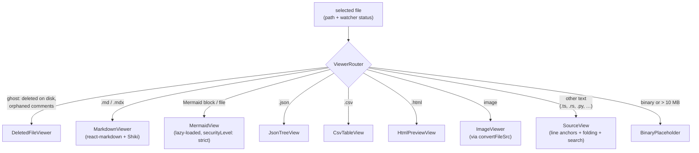

# Viewer

## What it is

mdownreview renders the selected workspace file in the reading pane. It handles markdown (with GFM + Mermaid), source code with syntax highlighting and folding, structured formats (JSON, CSV, KQL plans, HTML), images, and binary files — and also knows how to show an orphaned comments view when the underlying file has been deleted.

## How it works

`ViewerRouter` inspects the file extension and routing hints (including "ghost" state from the watcher) and mounts the appropriate concrete viewer. Each concrete viewer reads content via `useFileContent`, which calls the single Rust IPC command (chokepoint: rule 1 in [`docs/architecture.md`](../architecture.md)) and applies size/binary guards.

Markdown goes through `react-markdown` + `remark-gfm` + `@shikijs/rehype` + `rehype-slug`. Source files go through `SourceView`, which adds line-based comment anchors, fold regions, and a local search bar. Mermaid diagrams lazy-load the Mermaid renderer through `MermaidView` so the app startup stays within the [performance budget](../performance.md).

A single Shiki highlighter instance is shared across viewers — see the Shiki singleton rule in [`docs/design-patterns.md`](../design-patterns.md). The table of contents, selection toolbar, and viewer toolbar are composable overlays, not viewer-specific code.

## Key source

- **Router:** `src/components/viewers/ViewerRouter.tsx`
- **Concrete viewers:** `src/components/viewers/{MarkdownViewer,SourceView,EnhancedViewer,MermaidView,JsonTreeView,CsvTableView,HtmlPreviewView,KqlPlanView,ImageViewer,BinaryPlaceholder,DeletedFileViewer}.tsx`
- **Overlays:** `src/components/viewers/{TableOfContents,SearchBar,ViewerToolbar,FrontmatterBlock,SkeletonLoader}.tsx`
- **Hooks:** `src/hooks/{useFileContent,useSourceHighlighting,useFolding,useScrollToLine,useSearch}.ts`
- **Rust backend:** `src-tauri/src/commands/fs.rs` (`read_text_file`, `read_binary_file`, `check_path_exists`)

## Related rules

- File-size budgets and viewer layering — [`docs/architecture.md`](../architecture.md) §Component & viewer boundaries, §File-size budgets.
- Render-cost and Shiki singleton — [`docs/design-patterns.md`](../design-patterns.md) + [`docs/performance.md`](../performance.md).
- Markdown XSS posture (rehype-raw policy, Mermaid sandboxing) — [`docs/security.md`](../security.md).
- UI-visible viewer changes require browser e2e in `e2e/browser/` — rule 7 in [`docs/test-strategy.md`](../test-strategy.md).
