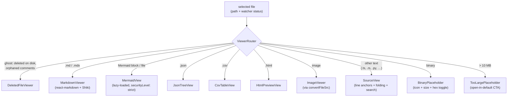

# Viewer

## What it is

mdownreview renders the selected workspace file in the reading pane. It handles markdown (with GFM + Mermaid), source code with syntax highlighting and folding, structured formats (JSON, CSV, KQL plans, HTML), images, and binary files — and also knows how to show an orphaned comments view when the underlying file has been deleted.

## How it works

`ViewerRouter` inspects the file extension and routing hints (including "ghost" state from the watcher) and mounts the appropriate concrete viewer. Each concrete viewer reads content via `useFileContent`, which calls the single Rust IPC command (chokepoint: rule 1 in [`docs/architecture.md`](../architecture.md)) and applies size/binary guards.

Markdown goes through a hardened `react-markdown` pipeline: `remark-gfm` (incl. footnotes + task lists) + `remark-github-blockquote-alert` (GitHub-style `> [!NOTE|TIP|WARNING|CAUTION|IMPORTANT]` callouts) + `rehype-raw` + `rehype-footnote-prefix` + lazy `rehype-katex` (only loaded when `HAS_MATH_RE` matches the document body, see [`docs/performance.md`](../performance.md)) + `rehype-katex-style` + `rehype-sanitize(sanitizeSchema)` + `rehype-slug` + `rehype-autolink-headings` + `@shikijs/rehype`. Plugin order is load-bearing — sanitization happens between raw HTML re-parse and any downstream plugin that injects elements, so user HTML cannot piggy-back through (rule 12 in [`docs/security.md`](../security.md)). The two narrow KaTeX preprocessors are required because KaTeX emits inline `style` attributes for math layout; `rehype-katex-style` strips `style` from any non-katex `span`/`math` so raw HTML cannot smuggle styles through. Source files go through `SourceView`, which adds line-based comment anchors, fold regions, and a local search bar. Mermaid diagrams lazy-load the Mermaid renderer through `MermaidView` so the app startup stays within the [performance budget](../performance.md), and embedded ` ```mermaid ` fenced blocks render inline through the same lazy chunk.

Per-filetype zoom (Ctrl+= / Ctrl+- / Ctrl+0) is wired through `useZoom(filetype)` and the `bumpZoom(filetype, "in"|"out"|"reset")` action — a single Zustand chokepoint that clamps to `[ZOOM_MIN, ZOOM_MAX]` and rejects non-finite inputs. The map `zoomByFiletype` (e.g. `{ ".md": 1.21, ".image": 2.0 }`) is the only viewerPrefs field that is persisted (small bounded map; persistence allowlist documented in rule 15 of [`docs/architecture.md`](../architecture.md)). The `ImageViewer` uses pointer events with `setPointerCapture` so a drag survives moving outside the canvas, and the pan offset is clamped to the laid-out image bounds × zoom so the image cannot leave the viewport.

Remote `` references are gated: the markdown viewer detects `` or raw `` (excluding code fences/inline ticks) and shows an "Allow remote images for this document" banner. Until the user opts in via `viewerPrefsSlice.allowRemoteImagesForDoc`, every remote image renders as a `RemoteImagePlaceholder`. Once allowed, the bytes flow through the bounded `fetch_remote_asset` Rust command (https-only, 8 MB cap, 10 s timeout, `image/*` allowlist, redirect policy capped at 5 https-only hops, semaphore-capped concurrency — rule 27 in [`docs/security.md`](../security.md)) and become `blob:` URLs, leaving the CSP `img-src` intact.

The markdown anchor handler classifies clicks into four cases: in-document `#anchor` (browser default), `javascript:`/`file:`/`data:`/`vbscript:` (dropped + warned), external `http(s)`/`mailto`/`tel` (delegated to the OS opener via `openExternalUrl`), and workspace-relative paths (resolved through `resolveWorkspacePath` for containment, then `useStore.openFile`). The HTML preview iframe applies the same four-case routing inside the safe-mode iframe.

A single Shiki highlighter instance is shared across viewers — see the Shiki singleton rule in [`docs/design-patterns.md`](../design-patterns.md). The table of contents, selection toolbar, and viewer toolbar are composable overlays, not viewer-specific code.

`CsvTableView`, `JsonTreeView`, `MermaidView`, `ImageViewer`, and `HtmlPreviewView` are commentable surfaces — see [`comments.md`](./comments.md) §"Structured-viewer entry points" for their per-viewer entry points and the typed anchors they produce. All commentable viewers also expose a right-click / Shift+F10 context menu (F6); see [`comments.md`](./comments.md) §"Right-click context menu (F6)". The HTML preview adds a comment-mode toggle that flips the iframe sandbox from `allow-same-origin` (safe default) to `allow-scripts` (cross-origin sandbox so the bridge IIFE can run); the two flags are never combined (rule alongside #12 in [`docs/security.md`](../security.md)).

Markdown and HTML preview render inside a centred `.reading-width` column whose width is clamped to `--reading-width` (default 720 px, persisted in `uiSlice.readingWidth`, clamped to `[400, 1600]` by `setReadingWidth`). The viewer toolbar (Source / Visual / Wrap) is sticky-positioned at the top of its scroll container so it stays in view while the body scrolls. Two `ReadingWidthHandle` instances (left and right edges) let the user drag either side of the column outward to grow width symmetrically — a centred-column resize, not an asymmetric drag. The handle writes `--reading-width` to the container during pointermove (no React re-renders mid-drag) and only commits to the Zustand store on pointerup, so the resize stays at 60 fps regardless of body size.

- Print rendered markdown via toolbar Print button (Ctrl+P also works natively); hides app chrome via `@media print` stylesheet (`src/styles/print.css`) so only the rendered body prints, full width, black on white. Shiki code blocks render in dual-theme mode (`themes: { light, dark }` + CSS variables) so the print branch can flip them to the light variant without re-highlighting (#65 G3).



Binary files are routed by `read_text_file` returning the sentinel error `binary_file` (or `file_too_large`), at which point `useFileContent` issues a follow-up `stat_file` IPC to learn the byte size and surfaces it through the placeholder. `BinaryPlaceholder` shows a category-specific icon (archive / audio / video / pdf / font / executable / image / other), the inferred MIME hint, the formatted size, and four actions: open in default app, reveal in folder, copy path, and — for files under 1 MiB — toggle a hex preview. `HexView` reads the file via `read_binary_file`, decodes the base64 to a `Uint8Array`, and renders a 16-bytes-per-row offset/hex/ASCII dump; rendering is virtualised with a fixed 18-px row height once the buffer is ≥ 32 KiB so even the 1 MiB upper bound stays smooth. `TooLargePlaceholder` is the single-CTA variant for files above the 10 MB hard cap, since reading them into memory is intentionally not supported. The `reveal_in_folder` and `open_in_default_app` Rust commands enforce the workspace allowlist (rule 28 in [`docs/security.md`](../security.md)) before spawning any OS handler.

## Key source

- **Router:** `src/components/viewers/ViewerRouter.tsx`
- **Concrete viewers:** `src/components/viewers/{MarkdownViewer,SourceView,EnhancedViewer,MermaidView,JsonTreeView,CsvTableView,HtmlPreviewView,KqlPlanView,ImageViewer,BinaryPlaceholder,HexView,TooLargePlaceholder,DeletedFileViewer}.tsx`
- **Markdown helpers:** `src/components/viewers/markdown/{sanitizeSchema,rehype-footnote-prefix,rehype-katex-style,RemoteImagePlaceholder,useImgResolver,CommentableBlocks,MarkdownComponentsMap,MarkdownInteractionLayer}.tsx`. `MarkdownViewer.tsx` is the lean shell (state + scroll-to-line wiring); `MarkdownComponentsMap.tsx` returns the memoised `components`/`remarkPlugins`/`rehypePlugins` triple consumed by `<ReactMarkdown>`; `MarkdownInteractionLayer.tsx` bridges per-block click/hover events to the comment store; `CommentableBlocks.tsx` defines the per-block `+` gutter button and the popover that hosts inline threads. The split was performed in iter 5 of #71 to drop `MarkdownViewer.tsx` from 454 → 306 LOC and put each concern under the 400-line architecture rule (rule 23).
- **Overlays:** `src/components/viewers/{TableOfContents,SearchBar,ViewerToolbar,FrontmatterBlock,SkeletonLoader,ReadingWidthHandle}.tsx`
- **State:** `src/store/viewerPrefs.ts` (per-document remote-image allowance — session-only — and per-filetype zoom — persisted via the rule-15 allowlist)
- **Hooks:** `src/hooks/{useFileContent,useSourceHighlighting,useFolding,useScrollToLine,useSearch,useZoom,useGlobalShortcuts}.ts`
- **Rust backend:** `src-tauri/src/commands/fs.rs` (`read_text_file`, `read_binary_file`, `stat_file`, `check_path_exists`), `src-tauri/src/commands/remote_asset.rs` (bounded HTTPS image proxy), `src-tauri/src/commands/system.rs` (`reveal_in_folder`, `open_in_default_app` — workspace-allowlisted)

## Related rules

- File-size budgets and viewer layering — [`docs/architecture.md`](../architecture.md) §Component & viewer boundaries, §File-size budgets.
- Render-cost and Shiki singleton — [`docs/design-patterns.md`](../design-patterns.md) + [`docs/performance.md`](../performance.md).
- Markdown XSS posture (`rehype-raw` + `rehype-sanitize` pairing, Mermaid sandboxing) — rule 12 in [`docs/security.md`](../security.md).
- Bounded remote-asset fetcher — rule 27 in [`docs/security.md`](../security.md).
- Workspace allowlist for OS-handler IPC (`reveal_in_folder`, `open_in_default_app`) — rule 28 in [`docs/security.md`](../security.md).
- UI-visible viewer changes require browser e2e in `e2e/browser/` — rule 7 in [`docs/test-strategy.md`](../test-strategy.md).
