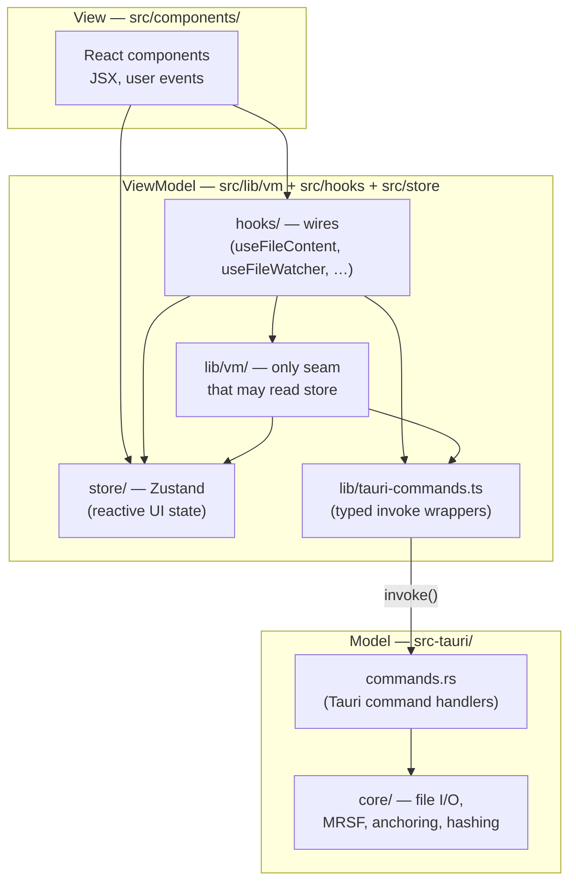

# Product Principles

Canonical charter for mdownreview. All other principles/rules docs derive from this one.

## One-sentence definition

mdownreview is a read-only, offline desktop reviewer that lets developers annotate AI-generated files in place — comments live beside the file, survive refactors, and never depend on a server.

## Five product pillars

Every feature, review decision, and engineering trade-off is judged against these five pillars.

### Professional
The app looks and feels like a tool a developer would pay for. Instant keyboard shortcuts, native menubar, polish details (ghost entries, comment badges, "Copy path" in About), no amateur rough edges. Shipping a feature that is visibly half-finished damages this pillar more than not shipping it at all.

### Reliable
Comments are the product, and comments are indestructible. MRSF sidecars, 4-step re-anchoring, ghost entries for deleted sources, atomic writes, save-loop prevention, and a watcher that survives editor rename patterns all exist to honor this pillar. A feature that risks losing a user comment does not ship.

### Performant
Fast startup, fast file open, fast search, fast render — even on folders of thousands of files. Performance is measured, not intuited. Budgets are numeric and tracked.

### Lean
Minimal memory, minimal disk, minimal dependencies, minimal binary size. Every new dependency earns its place. The app is a viewer, not a platform.

### Architecturally Sound
Clean layer boundaries, narrow IPC surface, single chokepoints for IPC and logging, testable in isolation. A codebase that stays comprehensible at 10× its current size.

## Three engineering meta-principles

How we work. Non-negotiable.

### 1. Rust-First with MVVM

The app is built as a strict MVVM (Model–ViewModel–View) stack. The boundaries are not suggestions.

- **Model — Rust** (`src-tauri/src/core/`, `src-tauri/src/commands/`). Owns data and business logic: file I/O, path manipulation, MRSF parse/serialize, comment anchoring, hashing, scanning, threading, validation. Exposed only via typed Tauri commands. Never reimplemented in TypeScript.
- **ViewModel — `src/lib/vm/` + `src/hooks/` + `src/store/`.** Bridges the Model to the View. Cancellation, loading states, debounce, derived values live here. No DOM, no JSX, no raw `invoke()` (uses `src/lib/tauri-commands.ts`).
- **View — `src/components/`.** Renders ViewModel state and dispatches user actions. No IPC calls, no business rules, no file-path manipulation.

When adding a feature: *what does the Model own? what hook in the ViewModel exposes it? what component renders it?* A component that calls `invoke()` or holds business state is a layering violation and does not merge. A hook that serializes YAML or computes anchors is a Rust-First violation and does not merge.

### 2. Never Increase Engineering Debt

Every change leaves the codebase cleaner than it found it. Literally:

- **Hold debt flat or reduce it.** A change that adds a new pattern without consolidating the old one is net debt. The cleanup ships in the same PR.
- **Close Gaps actively.** Every deep-dive doc has a Gaps section. When you're in the area, pick one and close it.
- **Delete dead code in the same PR.** A refactor that leaves the replaced function, import, or pattern around is incomplete.
- **No TODOs, no workarounds, no "fix later".** Solve it properly or don't make the change.
- **Drift from canonical patterns is debt** — not just bad code. Any divergence from `docs/architecture.md` or `docs/design-patterns.md` counts.

The goal is not to hold debt constant. It is to actively shrink it every change.

### 3. Zero Bug Policy

Every confirmed bug gets fixed. "Fixed" has three requirements:

- **Clean architecture.** The fix uses the layer boundaries in `docs/architecture.md`. If the bug exists because logic leaked across layers, the fix moves it back — no workarounds that silence the symptom.
- **Clean design pattern.** The fix uses the idioms in `docs/design-patterns.md` (cancellation flags, `useShallow`, `emit_to("main", …)`, atomic sidecar writes). A patch that violates an established pattern is new debt, not a fix.
- **Regression test.** Every fix ships with a test that reproduces the original failure mode. A race-condition fix needs a test that reproduces the race. Without the test, the fix is not done.

## Deep-dive documents

The rules that operationalize the pillars and meta-principles live in domain docs. Every rule is numbered and citable as "violates rule N in `docs/X.md`".

| Document | Governs |
|---|---|
| [`docs/architecture.md`](architecture.md) | Layer separation, IPC contract, Zustand boundaries, file-size budgets, MRSF v1.0 + v1.1 schema |
| [`docs/performance.md`](performance.md) | Numeric budgets, debounce windows, scan caps, render rules |
| [`docs/security.md`](security.md) | IPC surface, path canonicalization, markdown XSS posture, CSP, sidecar atomicity |
| [`docs/design-patterns.md`](design-patterns.md) | React 19 + Tauri v2 idioms, hook composition, error capture |
| [`docs/test-strategy.md`](test-strategy.md) | Three-layer pyramid, coverage floors, IPC mock hygiene |

## Non-Goals

Explicitly out of scope. Each would damage one of the five pillars.

- Editing file content (breaks *Professional* identity, bloats *Lean*).
- Git integration, diff views, version history (competitor space; pressures *Lean* + the 10 MB viewer limit).
- Cloud sync or real-time collaboration (breaks *Lean* + *Reliable* by forcing auth/backend).
- Plugin/extension system (breaks *Architecturally Sound* via stable-API lock-in).
- Remote log shipping or telemetry (breaks the offline trust model).
- Log viewer UI inside the app (log file + "Copy path" is sufficient).
- Linux `.desktop` file association.
- File type associations other than `.md`/`.mdx`.
- Built-in AI chat / "ask the agent" (mdownreview is the *human* side of the loop).
- Comment notifications / realtime multi-reviewer presence (solved asynchronously via sidecars + git).

## How to use this charter

- **Adding a feature?** It must strengthen at least one pillar without damaging another. If you can't identify which pillar it serves, it's not worth adding.
- **Reviewing a PR?** Check the diff against the deep-dive docs. Cite "violates rule N in docs/X.md".
- **Filing an issue?** Identify which pillar is degraded and quote the rule that covers it.
- **Disagreeing with a rule?** Propose a change to the rule. Don't work around it silently.
